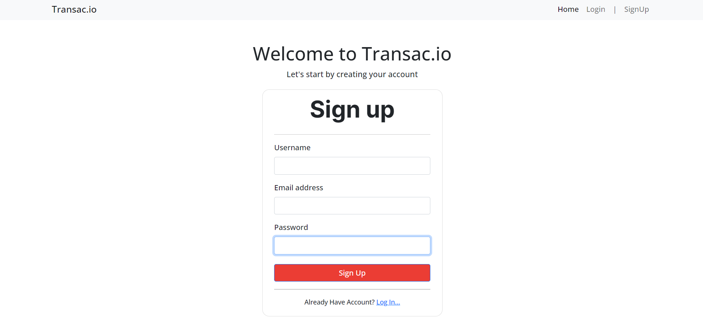

# Transac.io

A MERN Stack based website that stores users transactions. (currently suitable for desktop view only)

🔗 <a href="https://transac-io.web.app">Transac.io</a>

</img>

# How to use it?
1. Create an Account 🙍
    
2. Create Transac Book 📙
    
3. Add Transaction 🙂
    

## Transac Page

## Tech-Stack used 👨‍💻
1. React Js - FrontEnd
2. Node Js - Backend 
3. Express Js - Backend
4. Mongodb - Database

## Things To Work On 🏋️
* Making Responsive for Mobile view
* Adding  Transactions updating functionality
* Adding search Bar functinality

## License
Distributed under the MIT License. See LICENSE.txt for more information.

&copy; Transac.io 2022